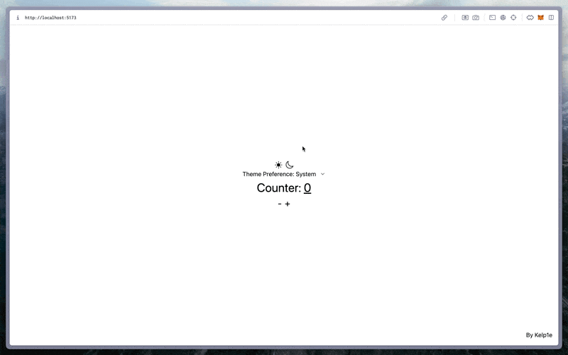

# React Effector Template

This project is a template for creating frontend applications using React and Effector. It includes a set of
dependencies and configurations to quickly start development.

## Installation

To get started, clone the repository and install the dependencies:



```bash
git clone https://github.com/Kelp1e/react-effector-template.git
cd react-effector-template
npm install
```

Get started:

```bash
npm run dev

# Or build
npm run build
npm run preview
```

Open [localhost:5173](http://localhost:5173) by default

You can also start Storybook:

```bash
npm run sb

# Or build
npm run sb build
```
